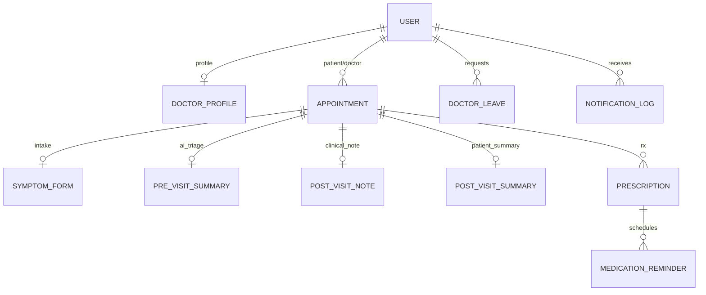

# Healthcare Appointment & Follow-up Manager (CareSync)


A production-grade, concurrency-safe healthcare platform featuring separate portals for **Patients**, **Doctors**, and **Administrators**. Built with the MERN stack and designed for senior-level evaluation with robust concurrency controls, background job processing, LLM-powered clinical summaries, digital PDF prescriptions, and Google Calendar sync.

---

## 🌐 Live Production Deployment

| Service | Live URL | Status |
|---|---|:---:|
| **Web App (Frontend)** | [https://healthcare-caresync-frontend.onrender.com](https://healthcare-caresync-frontend.onrender.com) | 🟢 Live |
| **API Server (Backend)** | [https://healthcare-caresync.onrender.com](https://healthcare-caresync.onrender.com) | 🟢 Live |
| **Health Check Endpoint** | [https://healthcare-caresync.onrender.com/api/health](https://healthcare-caresync.onrender.com/api/health) | 🟢 200 OK |
| **GitHub Repository** | [https://github.com/vikassourc/healthcare-caresync](https://github.com/vikassourc/healthcare-caresync) | 🟢 Public |

### 🔐 Live Demo Accounts

| Role | Email | Password | Access Level |
|---|---|---|---|
| **Patient** | `vsrivastava2004dec@gmail.com` | `Password123!` | Search doctors, hold slots, AI triage, receive PDF Rx |
| **Doctor** | `dr.rajesh.sharma@healthcarerx.com` | `Password123!` | Clinical notes, issue prescriptions, Google Calendar sync |
| **Admin** | `admin@healthcarerx.com` | `Password123!` | Roster management, leave scheduling, notification logs |

---

## Table of Contents
1. [Live Production Deployment](#-live-production-deployment)
2. [Why MongoDB](#why-mongodb)
3. [Architecture Overview](#architecture-overview)
4. [Key Features](#key-features)
5. [Database Schema & ERD](#database-schema--erd)
6. [API Documentation (30+ Endpoints)](#api-documentation)
7. [LLM Prompts & Graceful Fallback](#llm-prompts--graceful-fallback)
8. [Google Calendar Integration](#google-calendar-integration)
9. [Local Development & Setup](#local-development--setup)
10. [Automated Concurrency Testing](#automated-concurrency-testing)
11. [Future Architectural Improvements](#future-architectural-improvements)

---

## Why MongoDB
This project's domain model (appointments, specialist slots, doctor rosters, prescriptions) is inherently relational. In a PostgreSQL architecture, exclusion constraints (`EXCLUDE USING gist`) and `SELECT ... FOR UPDATE` row locks prevent double-booking out of the box.

**MongoDB was chosen deliberately to adhere to the MERN stack requirement**, and the relational-safety gap was engineered explicitly:
1. **Unique Compound Partial Index:** `{ doctorId: 1, slotStartTime: 1 }` with `partialFilterExpression: { status: { $in: ['HELD', 'CONFIRMED'] } }`. Cancelled and expired appointments do not block slot inventory, while active bookings are serialized at the database engine level.
2. **Atomic findOneAndUpdate:** Eliminated all read-then-write (`find()` followed by `save()`) race conditions by using atomic MongoDB filters.
3. **Graceful Conflict Handling:** Caught MongoDB `E11000` duplicate key exceptions and converted them into HTTP `409 Conflict` responses containing next-available slot suggestions.

---

## Architecture Overview

```mermaid
flowchart TB
    subgraph Frontend["Frontend (React 18 + Vite + Tailwind CSS)"]
        PP[Patient Portal]
        DP[Doctor Portal]
        AP[Admin Portal]
    end

    subgraph Backend["Express API Layer (Node.js + TypeScript)"]
        Auth[JWT & RBAC Middleware]
        BookSvc[Booking Service (Atomic Concurrency)]
        SlotSvc[Slot Service]
        LLMSvc[LLM Service (Anthropic Wrapper)]
        NotifSvc[Notification Service (Idempotent)]
        CalSvc[Calendar Service (OAuth 2.0)]
    end

    subgraph Background["Worker & Queue Layer"]
        Agenda[Agenda (Mongo-Backed Queue)]
        EmailJob[Email Sender (Exponential Backoff)]
        HoldJob[Hold Expiry Monitor (60s)]
        LLMJob[Summary Generator]
        LeaveJob[Leave Conflict Processor]
    end

    subgraph Storage["Data Tier"]
        MongoDB[(MongoDB 7.0)]
    end

    Frontend --> Auth
    Auth --> BookSvc & SlotSvc & LLMSvc & NotifSvc & CalSvc
    BookSvc & SlotSvc & NotifSvc --> MongoDB
    BookSvc --> Agenda
    Agenda --> EmailJob & HoldJob & LLMJob & LeaveJob
    EmailJob & HoldJob & LLMJob & LeaveJob --> MongoDB
```

---

## Database Schema & ERD



### Embed vs. Reference Decisions
| Collection | Strategy | Architectural Justification |
|---|---|---|
| **SymptomForm** | Reference | Created during the 5-minute `HELD` window before appointment confirmation. Independent schema lifecycle. |
| **PreVisitSummary** | Reference | Generated asynchronously by LLM workers. Keeping it separate prevents write locks on `Appointment`. |
| **PostVisitNote** | Reference | Authored by doctors independently; subject to clinical amendment history. |
| **Prescription** | Reference | Queried independently for daily 9:00 AM medication reminder jobs. |
| **NotificationLog** | Standalone | Global idempotency tracking and administrator dead-letter inspection. |

---

## API Documentation

### 1. Authentication
- `POST /api/auth/register` — Register patient or doctor account
- `POST /api/auth/login` — Authenticate and receive JWT access + refresh tokens
- `POST /api/auth/refresh` — Rotate refresh token and issue new access token
- `POST /api/auth/logout` — Revoke refresh token
- `GET /api/auth/me` — Return authenticated user profile

### 2. Patient Appointment Booking
- `POST /api/appointments/hold` — Atomically hold a slot for 5 minutes
- `POST /api/appointments/:id/confirm` — Confirm held slot and submit symptom form
- `POST /api/appointments/:id/cancel` — Cancel scheduled consultation
- `GET /api/appointments/my-appointments` — List patient's consultation history
- `GET /api/appointments/my-prescriptions` — List active patient prescriptions
- `GET /api/appointments/:id` — Fetch complete appointment details (symptoms, summaries)

### 3. Doctor Portal
- `GET /api/doctors/search` — Public specialist directory search
- `GET /api/doctors/:id/slots` — Compute available time slots for a given date
- `GET /api/doctors/portal/appointments` — List assigned doctor encounters
- `GET /api/doctors/portal/appointments/:id` — View encounter with AI Pre-visit Triage
- `POST /api/doctors/portal/appointments/:id/notes` — Submit clinical documentation
- `POST /api/doctors/portal/appointments/:id/prescription` — Issue medication prescription

### 4. Admin Management
- `GET /api/admin/dashboard-stats` — System metrics and telemetry
- `GET /api/admin/doctors` — Specialist directory roster
- `POST /api/admin/doctors` — Onboard new doctor profile
- `PUT /api/admin/doctors/:id` — Update doctor working hours and slot duration
- `POST /api/admin/doctors/leave` — Register doctor leave (triggers async fan-out)
- `GET /api/admin/notifications/dead-letter` — Inspect failed email queue
- `POST /api/admin/notifications/:id/retry` — Manually retry failed notification

---

## LLM Prompts & Graceful Fallback

### Pre-Visit AI Triage Prompt
```text
You are a senior clinical triage AI assistant. Analyze the following patient symptoms submitted in advance of their clinic visit:
Chief Complaint: {chiefComplaint}
Reported Symptoms: {symptoms}
Duration: {duration}
Severity Reported: {severity}
Additional Patient Notes: {additionalNotes}

Return ONLY a valid JSON object matching this exact schema:
{
  "urgencyLevel": "LOW" | "MEDIUM" | "HIGH",
  "chiefComplaint": "Concise 1-sentence clinical formulation",
  "suggestedQuestions": ["Targeted question 1", "Targeted question 2", "Targeted question 3"]
}
```

### Post-Visit Patient Summary Prompt
```text
You are a patient education AI assistant. Translate the following doctor's clinical notes and prescriptions into an empathetic, patient-friendly summary:
Clinical Diagnosis: {diagnosis}
Doctor Notes: {notes}
Follow-up Instructions: {followUpInstructions}
Prescriptions: {prescriptions}

Return ONLY a valid JSON object matching this exact schema:
{
  "summary": "Clear, jargon-free 2-3 sentence summary of findings",
  "medicationSchedule": ["Simple instruction for medication 1"],
  "followUpSteps": ["Clear actionable step 1", "Clear actionable step 2"]
}
```

---

## Google Calendar Integration
1. Create a Google Cloud Project and enable the **Google Calendar API v3**.
2. Configure an OAuth 2.0 Client ID with redirect URI `http://localhost:5000/api/calendar/callback`.
3. Set `GOOGLE_CLIENT_ID` and `GOOGLE_CLIENT_SECRET` in `.env`.
4. Doctors connect their calendar via `GET /api/calendar/auth-url`. Refresh tokens are securely stored and used by `CalendarService.syncAppointmentEvent` to push confirmed visits.

---

## Local Development & Setup

### Option 1: Docker Compose (One-Command Run)
```bash
docker-compose up --build
```
- Frontend: `http://localhost:5173`
- Backend API: `http://localhost:5000`
- Mongo Express GUI: `http://localhost:8081`

### Option 2: Local Node.js Execution
```bash
# 1. Start MongoDB
docker-compose up -d mongodb

# 2. Setup Backend
cd backend
npm install
npm run seed     # Seeds demo accounts
npm run dev

# 3. Setup Frontend
cd ../frontend
npm install
npm run dev
```

### Demo Accounts
| Role | Email | Password |
|---|---|---|
| **Admin** | `admin@healthcarerx.com` | `Password123!` |
| **Doctor** | `dr.sarah.connor@healthcarerx.com` | `Password123!` |
| **Patient** | `patient.john@example.com` | `Password123!` |

---

## Automated Concurrency Testing
Run the automated integration suite testing 10 simultaneous bookings for the exact same slot:
```bash
cd backend
npm run test:concurrency
```
**Test Guarantee:** Asserts exactly 1 request returns `201 Created` and 9 return `409 Conflict` with alternative slot recommendations.

---

## Future Architectural Improvements
1. **Express Rate Limiting:** Enforce IP-based rate limiting on `/auth` and `/appointments/hold` endpoints using `express-rate-limit`.
2. **Distributed Tracing & Structured Logging:** Transition to Pino/OpenTelemetry for distributed APM tracing across queue workers.
3. **WebSocket Real-Time Updates:** Push slot hold releases and live schedule changes directly to connected client dashboards via Socket.io.
4. **Multi-Region Atlas Clustering:** Configure MongoDB Atlas cross-region replication for read-heavy specialist search queries.
5. **HIPAA Audit Trail Collection:** Implement immutable audit logging tracking all PHI access by user ID, IP, and timestamp.
